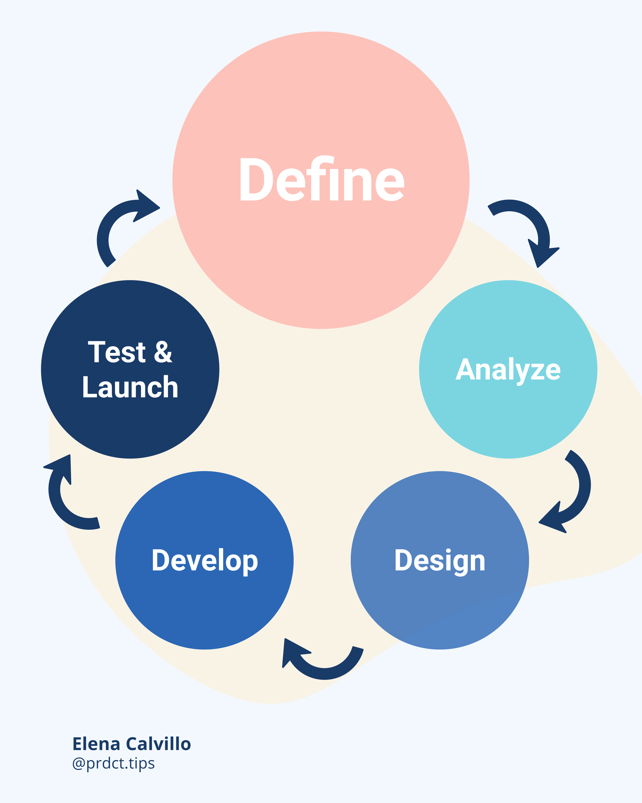

### 

I finally redesigned my website! I'm so happy to have this personal space where I can share tips, tutorials, processes, personal experiences and more.

As every digital product, there's a whole process behind it which involves research and applying some methods to launch a successful first version of it. Let's see each one of these steps in these series.

The first step of defining a product is starting with WHY. In this stage we'll try to answer all the possible questions to understand our users and our brand and how these are aligned to our main goal.

**Define the purpose**

- What's the purpose of the product?

    Define here what is your main goal? Why does it matters to build it?

    - Example: My website should increase brand awareness and generate leads in the upcoming years with blog posts.

- Make a list of 5 - 10 purposes
    - Build a community
    - Show posts and articles
    - Generate SEO
    - Drive traffic to Instagram
    - Create an email list

From all of these select the main purpose of the product. What is one thing that this product MUST do really well?

Examples:

- Airbnb's must be able to make reservations
- Spotify's main feature is to play songs
- My website must show blog posts

**Define your user**

Here I do a mix of targeting the product audience and understanding the brand and the user as in the Design thinking process by answering the following questions.

- **Who is your "user"?**
    - Digital creators
    - UX designers
    - Engineers
    - Marketers
    - Entrepreneurs
    - People already involved in a Product role
    - Passionate people that wants to learn constantly
- **What are the problems or desires of your user?**
    - They don't know what product management is
    - They don't know how to launch a product
    - They would like to know methods to launch a product
- **Where does your user find the information it needs?**
    - Books
    - Instagram carousels, reels
    - Blogs
    - Courses
    - Videos
    - Masterclasses
    - Mentors
- **Who does your user trust?**
    - Valuable reviews
    - A solid image
    - Trustable information
    - Valid sources
- **What does your user dislike?**
    - Things that does not work
    - Confusing message or content
    - Being scammed

**Understanding your brand**

- **How does your product aligns to your brand?**

    We need to know how this product will benefit and it's aligned to the company's values and mission. 

    > Your product must justify its main reason to exist.

    In my case, turning my website from a front-end developer resume to a product owner oriented site with the ability to publish posts will increase my brand awareness because people will start to notice what I do through my content.

    Valuable content plus the right SEO strategy will impulse my website on search engines and this powerful combination will continue supporting the increment of brand awareness.

    Create your formula first and see which elements can help you to achieve your main product's purpose.

**Define success criteria**

Finally, it's good to establish how do you plan to know if this strategy of yours will be successful. To do this we need to make a list of 5 to 15 indicators that will help us to understand if we're on a good track.

But these indicators MUST BE MEASURABLE. If they cannot be measurable, they are useless.

These indicators could be:

- 10% of traffic increment on my website compared to last version
- Generate an email list of 300 subcribers
- 3% more of daily user visits
- 5% of visits expansion to another country
- Generate 3 potential clients each month

With these points you should be able to feel more comfortable about the purpose of your product and where this will get to. It will get more interesting in the next stages.

Check out the free template to fill out all of this information:

[Product Development](https://www.notion.so/Product-Development-70f63b74640f433198d2d396385e1bf2)