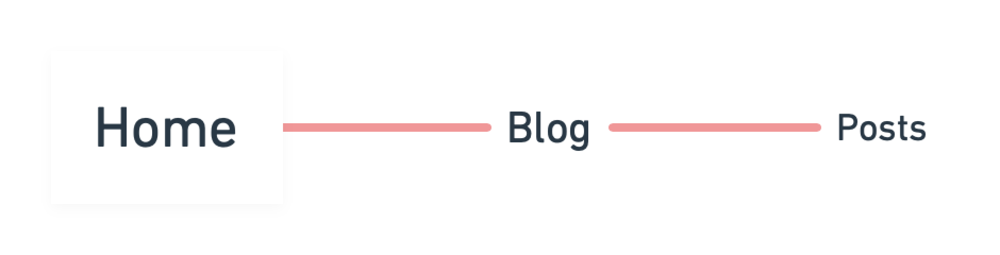
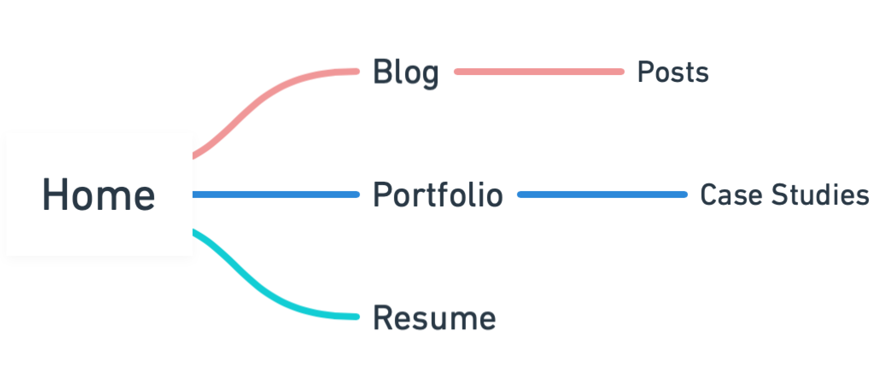
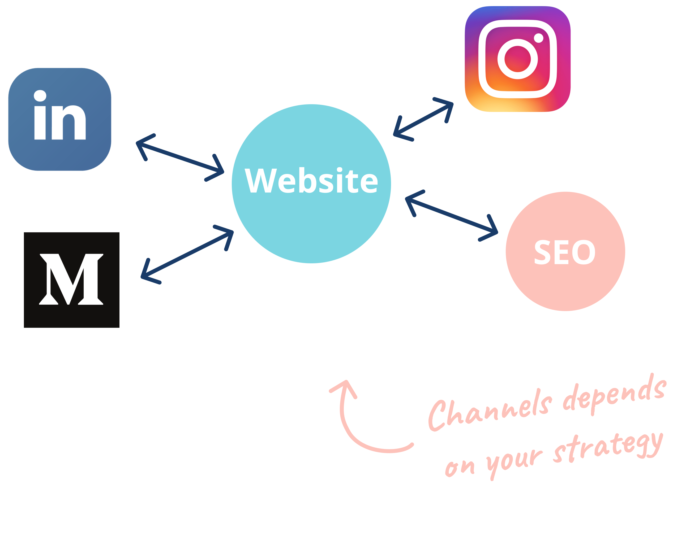

One of my favorite stages is the design phase. It feels so good to start creating roadmaps and mockups or wireframes but the truth is, if we skip the definition of our problem and the research analysis we will probably build a beautiful product with no sense of existence.

The assets that this stage will generate are:

- Site map
- User flow
- Mockups
- Branding:
  - Imagery
  - Icons
  - Colors

I personally like to have the **product roadmap before the beginning of this stage** and consider the amount of effort and time that the design stage will require for the whole product development.

So after the definition of the problem and the analysis of the research, it comes a combination between planning and the creation of design deliverables to help our development phase go smooth and according to the goal.

So the full list in my case will be:

- **Roadmap:** Strategic plan with major steps to reach the goal.
- **MVP:** The minimum viable version of your product that works.
- **Site map:** A list of all the pages and subpages your website will have.
- **Wireframes:** Is a low fidelity prototype of what the product will look like.
- **User flow:** A diagram of how the user will interact with the product.
- **Mockups:** A prototype that communicates the final design for demonstration.
- **Branding:** What will differentiate your product from the rest, the essence.
  - Imagery
  - Icons
  - Colors
  - Typography

Since the main goal is to have a place where I can write articles to create brand awareness and promote any type of content or templates for the community I decided to go for a website that will be my own blog, resume, portfolio, case studies, newsletter, etc.

The **MVP helps to deliver this first version of the product without building the whole monster** and fail at the end after putting too much effort on it. So in this case, to accomplish the goal a website that has blog posts will be enough as a first version.

Then it will evolve with time.

Remember this is an iterative process, it won't be perfect from the beginning some changes may appear and you'll have to redo what you have done. So better get ready with tons of cups of coffee! ☕️

The main strategy will be: **Have a website that supports other channels.**

The majority of online traffic is driven by search engines. Having a website and the right SEO will work like a snowball effect over time in your favor.

The tool I used to design the Site map and the Wireframes is [Whimsical](https://whimsical.com/). I needed a tool that allowed me to care more about the content and spend less time styling my diagrams.

Whimsical allows me to create diagrams even faster and I used the mind maps to create my site map and their powerful wireframes tool to represent my website structure!

On their website you can play with live demos and allows you to interact with different elements so you can convince yourself.

[Whimsical Mind Maps](https://whimsical.com/mind-maps)

Here is also a video of how Wireframes work:

[https://player.vimeo.com/video/270725085](https://player.vimeo.com/video/270725085)

I personally think you should use a design tool that you feel comfortable with and that allows you to feel free to create as much as you require and fulfill your and your project's necessities.

Finally, but not less important. My final advice is **document everything**! Don't leave anything behind try to document everything, all the information that you create now will remain valuable in the future.

Also as you iterate you'll have to re visit the documentation again so try to organize and keep record of each piece of research, maps, diagrams, etc. You don't know when you'll have to use them again.
