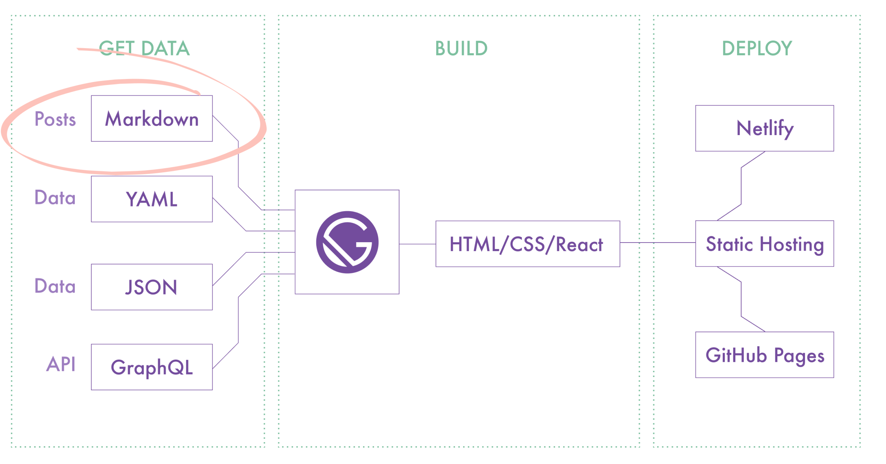

I have to admit this is my favorite part of the whole process. When you’re finally creating your Frankenstein and see how it’s getting shaped.

First, let's remember the product you came up with the first stages. Is your product a web tool? an ebook? or a service? This has been established before with a proper: definition of the problem, research and analysis and then designing it.

You should not develop until you have these answers, these are your product’s foundations. There are some products that survive a big change when it requires a whole new strategy, but that's not the fairy tale story for the rest.

I know I repeat this too often but it's for your own good. It's not easy to rebuild a whole app in another programming language, it costs money and can harm your product lifecycle.

A proper research will lead us to the conclusion that in most of the cases these are some of the aspects to consider in this phase:

- Technologies
- Programming languages
- CMS (Content Management System) platforms
- Hosting (where your product lives)
- Domains (www.yourproduct.com)
- Analytics tools
- Plugins, apps integrations
- Support
- 3rd party services

From my research, using **[React](https://reactjs.org)** is the right choice:

- Is a **JavaScript library**.
- Is **SEO friendly.** Google loves React as is easy to crawl, thumbs up!
- It has a big community, is **easy to find help.**
- Big companies use it like Amazon, Uber, Airbnb, Netflix, etc. So it’ll be **supported for long time.**
- **Extra:** valuable skill for developers \$\$\$\$

### Hosting, domain and analytics decisions

- **[GitHub Pages:](https://pages.github.com)** GitHub offers free hosting for static websites. Also, you can secure your site with HTTPS and use custom domains. (pages.github.com)
- **Google Domains:** Because is simple to use and I can integrate it with Gmail.
- **Google Analytics:** to get basic data of how the audience interacts.
- **[Hotjar:](http://hotjar.com)** To receive feedback of my website from users.

### The blog feature

My website is static, I’m not using a CMS like Wordpress. Yet I’m not creating manually each one of the posts, that would be insane!

Just imagine it, I would had to create a new subpage every time I have a new blog entry and manually add all the paragraphs inside 
 tags and re create that for each post. Not to mention that I will have to also edit the homepage and the blog page to show my latest card.

It just not worth it.

So to avoid that tedious manual task I decided to go for [Gatsby](https://www.gatsbyjs.com) is a React framework that turns your static site into a progressive web app and [Netlify](https://www.netlify.com) deploys this even faster.

The Gatsby community is big, it has many app integrations, plugins and templates to help you get started!

If you want to know more I suggest you to visit the Gatsby website and review their documentation is super complete.

[Welcome to the Gatsby Way of Building | Gatsby](https://www.gatsbyjs.com/docs/)

### How does it works for me?

1. I write my blog posts in [Notion](https://www.notion.so/) (YES! As simple as that).

2. I export the post in Markdown (YES! Markdown has compatibility with thousands for other apps).

3. Save the export into my website’s folder.

4. Push the changes to GitHub and create a pull request to the main branch.

5. Netlify makes the rest for me!

As simple as this I just focus myself into creating content and improving my website according to the evolutive MVP with plugins and app integrations. All the styles and format remains in the CSS so I don't have to change something on every publication.

Thanks to all these open-source tools I’m able to have a website fast and simple. Always evaluate what you’ll need to create your product, changing something after can cost you very high!

Decide wisely the ingredients your product must have and which technologies can help you achieve the goal.
