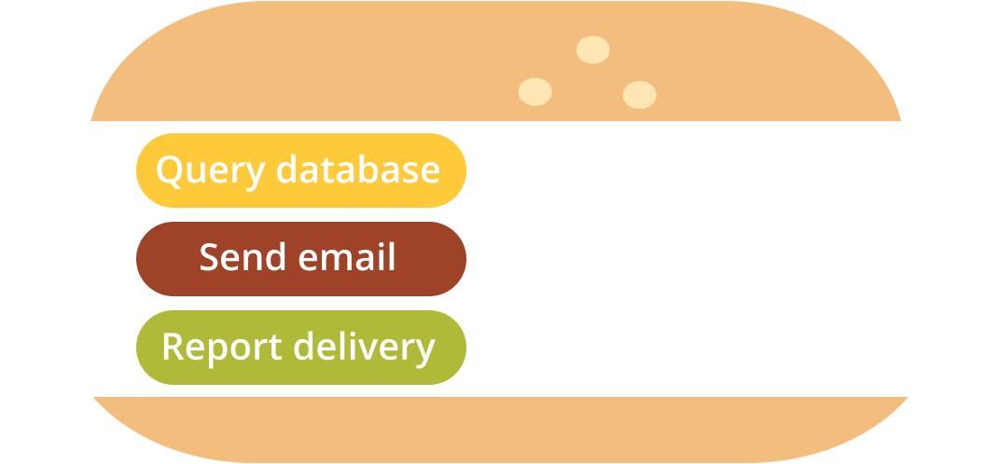
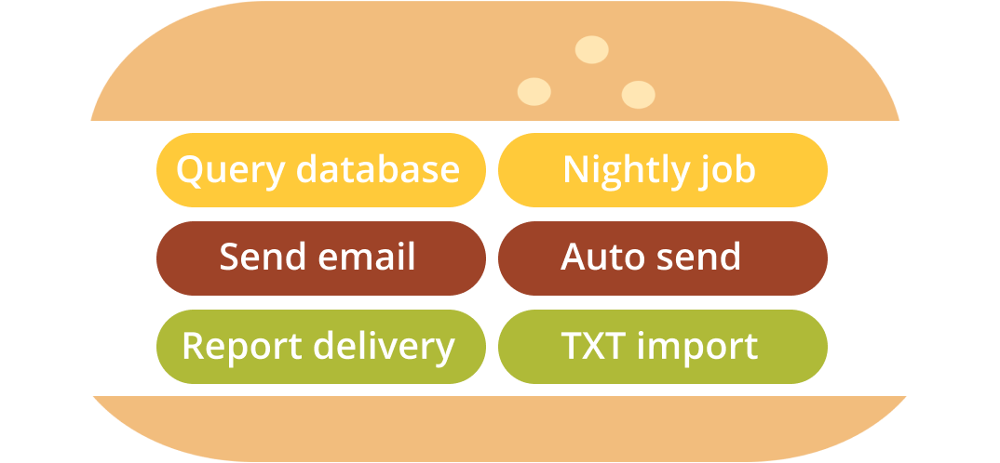
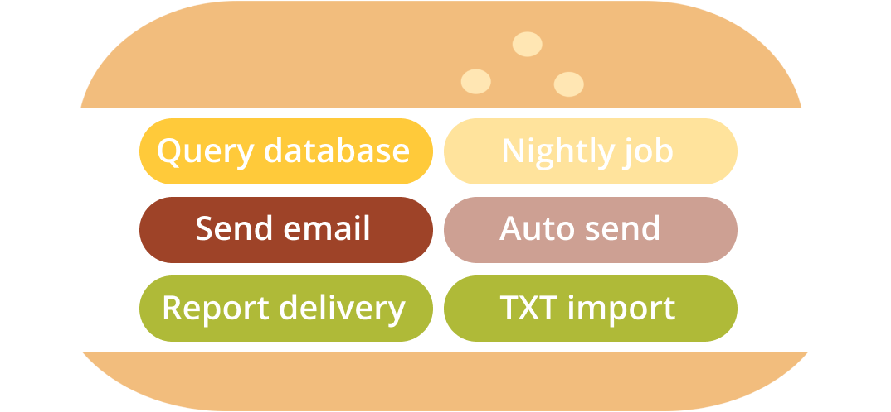
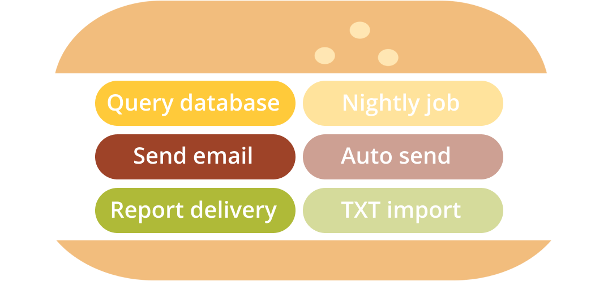

Prioritizing user stories can be difficult for teams that has no experience with Agile methods. The frustration of learning a new framework and getting the job done can lead to desperation and in result a list with very big user stories that can't fit in the next sprints.

But this changed in 2012, Gojko Adzic introduced the hamburger method method that offers to split big User Stories in a very easy way.

Ready to do it? Follow these steps:

Let's imagine that the bread of the hamburger is your epic or big user story and inside the hamburger will be a list of all the tasks and sub-tasks.

1. Identify tasks: In group, identify technical steps that would be involved in implementing a story on a high level.

2. Identify options: Split the team into small groups and ask them to define quality for each task. They should write down several options on different levels of quality.

3. Combine results: Add the tasks inside. Remove duplicates and align tasks from left to right based on the level of quality.

4. Trim the hamburger: As a group, go through tasks and compare the lowest quality options with things next to them, based on how difficult it would roughly be to implement each option.
5. Take the first bite: How deep you’ll take the first bite? Discuss what is the minimum acceptable level of quality for each step.

6. Take another bite (yum!)... From now on, any further bite should provide more quality, regardless of what you add.

Very simple right? Although, as every method there are scenarios where this applies and when it just won't work as you expect. Let's see...

**Try to avoid these method on these circumstances:**

- When the user story is already to small to split
- When the Agile team already masters the user story mapping

**When you can use this method?**

- This method is perfect when the teams are new to agile
- When the User Stories are actual technical implementations
- When the majority of the members of the team are developers
- When the Product Owner already split the User Stories from Business Value perspective

I'll leave here the website of Gojko Adzic where you can find more information about the hamburger method.

[Splitting user stories -- the hamburger method](https://gojko.net/2012/01/23/splitting-user-stories-the-hamburger-method/)

Thanks for reading!