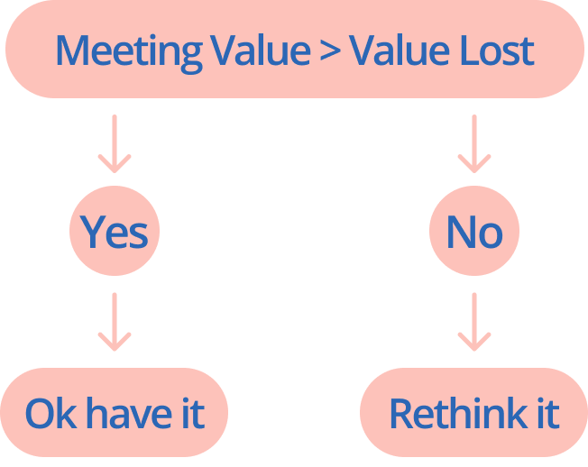

Have you’ve been in a meeting that could have been an email instead? Looking at your clock for the time to end and at the end, there were no clear actions to take and nobody understood what was the real point of having it!

### What’s the goal?

Set the goal of the meeting. What do you want to achieve to use other people’s time?

Remember, time is money. You don’t want to waste it. Are you sure it can’t be an email?

Follow this formula:

Does this meeting creates more value than the value lost by people attending to it?

### Set up an agenda

The agenda must follow a path to discuss from A to B point. Always trying to achieve the goal.

| Name                         | Minutes       |
| ---------------------------- | ------------- |
| 1. Introduce the B point     | 5             |
| 2. Discuss the A point       | 10            |
| 3. How to get from A to B?   | 10            |
| 4. Closure, set next actions | 5             |
|                              | Total: 30 min |

### Send an email beforehand

Help everyone involved to have a clear vision of what the purpose of the meeting is by sending an email before detailing:

- The goal to achieve
- The problematic
- The agenda with timing
- Attach useful resources

### Document the meeting

After the meeting, send an email with the next actions and notes.

Hi all,

Thanks for attending to discuss **\_\_\_**, we've decided to ****\_\_****.

Next steps will be:

- Person 1: **\_\_\_\_**
- Person 2: **\_\_\_\_**
- Person 3: **\_\_\_\_**

Thanks everyone again for attending.

Remember, always be clear and transparent about your goal with your participants. Their time is valuable too.

Now you're ready to conduct every meeting and your colleagues and stakeholders will love you!
