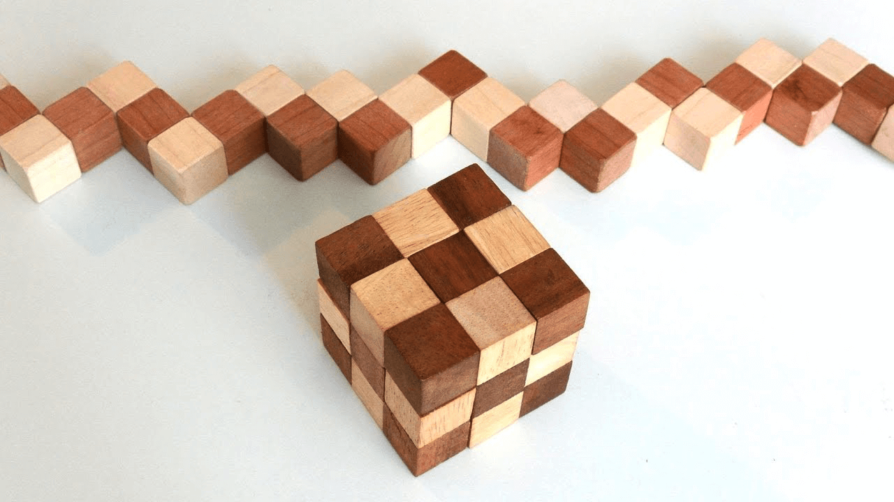

My boyfriend and I planned a trip to Mazamitla, it's a small town in Jalisco, Mexico. We needed a quiet and calm place to depurate us from the loud noise of the city. We suddenly fell in love with that place when we arrived. It is a small town but with a lot of magic and enchantment.

One of the first things we did, was going to a gift shop because I wanted to have something traditional from that place. Inside the shop, I've found a very unusual toy. At least, I haven't seen it before.

It was small cube made of wood, it looked like a Rubik's cube yet it's called serpent cube. Because when you unfold it, looks like a serpent. Every little cube is tied together by a string.

When we arrived at the cabin, the first thing I did was to play with it. It looked so easy to resolve when everything was in its place... The reality is that it was harder than I expected.

It was an exciting challenge, I was deeply into resolving this puzzle. Took me around 2 hours to finish it. Okay I resolved it but, what about doing it again? Will my brain remembered each of the steps? So I did it again and again until I mastered each step and finish it in less than 1 minute.

### How is this related to problem-solving?

The process of solving a problem comes in many different and unique ways for each one of us. I realized that mine has to do with these steps:

**1. Problem definition**

- What is the problem that you're facing with? Diagnose the situation and describe it as much as possible.
- What is the main goal in this? What do you want to achieve?
- Following the serpent cube example:
  - Input: The puzzle must be resolved
  - Output: I need to know how to do it

**2. Brainstorm solutions**

- Generate alternative solutions, as many as you can.
- Make a list of all the possible solutions that are tied to the main goal.

**3. Pick a solution**

- From all the solutions you thought on the last step, which one seems to be the best to resolve the problem?
- This solution needs to meet the main goal to resolve the problem.

**4. Implement the solution**

- This stage requires planning and executing the idea you've selected.
- Testing is key in this part, you should test before launching the product but don't expect everything to be perfect.

**5. Evaluate and improve**

- At the end, what did you do? Did you resolved the problem?
- Review what worked, what didn't and how things can be improved

Resolving this cube was a revelation to me. I realized that these are the basic steps of resolving every problem of every kind. This list will also help you to resolve any type of problem.

You could be doing this same type of thinking process in your current job position, everyone of us has this analytical mindset we're just need to put attention to it. Next time you want to solve a puzzle or a game put attention on which are the steps you follow, you could be surprised!
