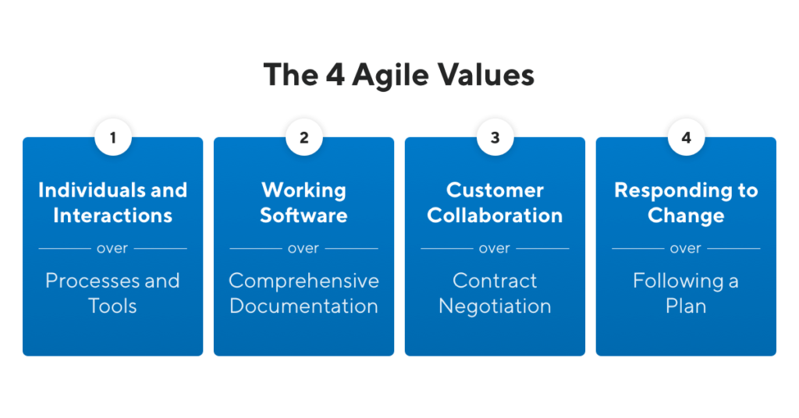

I have a question for you today, should we still using the Agile Manifesto? Before you thought of an answer let me give you some context about it.

20 years ago, 17 software practitioners went to ski to the Wasatch mountains in Utah. The intention was to relax, talk, ski and gather around.

Believe it or not, the result of that experience was the Agile Manifesto. They discussed an alternative to documentation and heavyweight software development processes.

They called themselves "The Agile Alliance". Considered as group of independent thinkers about software development. And created the *Manifesto for Agile Software Development* on February 2001.

### **Who is the The Agile Alliance?**

The group was formed with different roles in the software development industry, some of them partners and others competitors between each other.

Meet all 17 members who signed the original Agile Manifesto back in 2001:

- [Kent Beck](https://www.kentbeck.com/), who co-created [eXtreme Programming (XP)](https://www.productplan.com/glossary/extreme-programming/)
- [Mike Beedle](https://en.wikipedia.org/wiki/Mike_Beedle), co-author of Agile Software Development with Scrum
- [Arie van Bennekum](https://twitter.com/arievanbennekum?lang=en), owner of [Integrated Agile](http://integratedagile.com/)
- [Alistair Cockburn](https://alistair.cockburn.us/coming-soon/), IT strategist and creator of the [Crystal Agile Methodology](https://www.productplan.com/glossary/crystal-agile-framework/)
- [Ward Cunningham](http://c2.com/~ward/), inventor of wiki and first to coin term [technical debt](https://www.productplan.com/glossary/technical-debt/)
- [Martin Fowler](https://martinfowler.com/), software practitioner, and partner at [Thoughtworks](https://www.thoughtworks.com/)
- [James Grenning](https://wingman-sw.com/about), author of Test-Driven Development
- [Jim Highsmith](http://jimhighsmith.com/), creator of [Adaptive Software Development (ASD)](https://www.productplan.com/glossary/adaptive-software-development/)
- [Andrew Hunt](https://en.wikipedia.org/wiki/Andy_Hunt_(author)), co-author of *The Pragmatic Programmer*
- [Ron Jeffries](http://ronjeffries.com/), co-creator of eXtreme Programming (XP)
- [Jon Kern](https://www.linkedin.com/in/jonkern/), who still helps organizations with agile today
- [Brian Marick](https://twitter.com/marick), a computer scientist and author of [several books](https://leanpub.com/outsidefp) on programming
- Robert C. Martin, also known as “Uncle Bob,” who consults via [Clean Coding](https://blog.cleancoder.com/)
- [Steve Mellor](https://www.revolvy.com/page/Stephen-J.-Mellor), a computer scientist also credited with inventing Object-Oriented System Analysis (OOSA)
- [Ken Schwaber](https://kenschwaber.wordpress.com/), who co-created Scrum with Jeff Sutherland
- [Jeff Sutherland](https://www.scrumalliance.org/community/profile/jsutherland), the inventor, and co-creator of [Scrum](https://www.productplan.com/glossary/scrum-agile-framework/)
- [Dave Thomas](https://pragdave.me/blog/2014/03/04/time-to-kill-agile.html), programmer, and co-author of *[The Pragmatic Programmer](https://www.amazon.com/Pragmatic-Programmer-Journeyman-Master/dp/020161622X)*

### **And what does the Agile Manifesto says?**

The manifesto states the following:

> We are uncovering better ways of developing
software by doing it and helping others do it.
Through this work we have come to value:

> Individuals and interactions over processes and tools
Working software over comprehensive documentation
Customer collaboration over contract negotiation
Responding to change over following a plan

> That is, while there is value in the items on
the right, we value the items on the left more.

Did you sense the last phrasing of the Manifesto strongly powerful? Me too. And so do their founders!

"I personally didn't expect that this particular group of agilites to ever agree on anything substantive." Alistair Cockburn said. "Speaking for myself, I am delighted by the final phrasing [of the Manifesto]. I was surprised that the others appeared equally delighted by the final phrasing. So we did agree on something substantive."

The Agile Manifesto not only focus on software development processes itself, instead gives more value to:

- Individuals and interactions
- Working software
- Customer collaboration
- Responding to change

The 4 Agile Values by [ProductPlan](https://www.productplan.com/glossary/agile-manifesto/)

The Manifesto creates an atmosphere of respect and collaboration and beyond. In Jim Highsmith words, it's the privilege to work with a group of people with a set of compatible values. Values based on trust and respect for each other. Promoting organizational models based on people, collaboration, and building the types of organizational communities in which we would want to work.

It's about delivering good products to customers by operating in an environment that does more than talk about "people as our most important asset" but actually "acts" as if people were the most important, and lose the word "asset".

If you want to know more about the values and principles of the Agile Manifesto I recommend to you these 2 great articles from ProductPlan:

- [Overview of the 4 agile values](https://www.productplan.com/glossary/agile-values/)
- [Overview of the 12 agile principles](https://www.productplan.com/glossary/agile-principles/)

### **A new era is coming**

It's been 20 years now! Things have changed a lot the last decades. Does the Agile Manifesto still valid nowadays?

Even though the Agile Manifesto will always be the remembered as a landmark in the whole software development history. It's time to be do a big change.

Product Managers global influence it's constantly increasing. From Jeff Bezos to Elon Musk, many PM leaders run some of the most innovative and successful companies around the world.

We need to define a new era for Product Management in a world that's dealing with environmental changes, pandemics, the lack of diversity and inclusivity. All to make a positive change.

### **What can we do?**

Product Manager Mayank Yadav, who has built products at Facebook, eBay, and Uber. Is gathering together a team of Product professionals who will help discover and define the principles for this new era.

> "Product Managers at all stages of their careers need an actionable blueprint that will inspire them to become better at their jobs and ultimately help them make better products." – Mayank Yadav

Product School and Product Manifesto are partnering to provide a framework for all Product Managers so we can:

- Leverage and benefit from it
- Build mastery
- Uplevel product quality
- Make a positive impact in the world

And guess what? They are inviting every Product Manager to be part of this historical change!

### **How to be part of the new Product Manifesto?**

All you'll have to do is to fill a quick survey! All the instructions are on the official [Product Manifesto website.](https://www.product-manifesto.com/) You can actually see the roadmap they have planned for the entire project.

This initiative will help to create an inclusive, credible, and actionable manifesto for all Product Managers around the world.

In a short survey, you can share your thoughts on the Product Manifesto and express the values that you believe PMs should live by.

Don't miss out the opportunity to be part of a big change in the software development history!