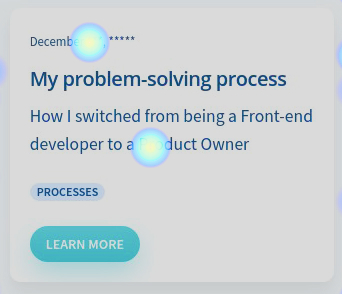
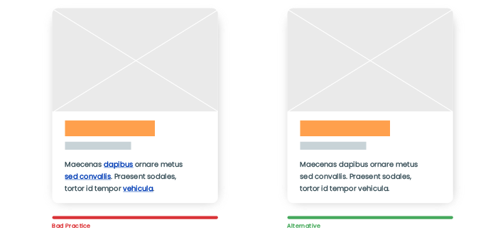

How is your product going after the launch date? Is it getting too many visitors or just phew? How are your users interacting with it? Is it getting the conversions you planned?

A good data analysis after your launching date can give you useful insights of how your users interact with your product. Analytics can help you with this part, depending on your favorite or convenient analytical tool, metrics will show your users behavior so you can improve your product's experience.

Taking my website [elenacalvillo.com](http://elenacalvillo.com) as a good example of this. I installed [Hotjar](https://www.hotjar.com/) in my website, I've never used before but it offers me to:

- **[Feedback](https://www.hotjar.com/tour/#incoming-feedback)**: Get feedback directly from my users (they can send me screenshots also). Quick, efficient and not intrusive, anyone can submit their feedback without providing their email and at the same time you find opportunities to grow.
- **[Heatmaps](https://www.hotjar.com/tour/#heatmaps)**: Generate heatmaps of how your users interact. The interesting part of this functionality is that there are 3 types of heatmaps: per clicks, cursor move and how they scroll.
- **[Recordings](https://www.hotjar.com/tour/#recordings)**: Small videos of how your users navigate and interact with your product. This wonderful feature allows you to see what your user sees and go through their pain also. Basically, is living in your user's shoes.
- **[Surveys](https://www.hotjar.com/tour/#polls)**: Ask thoughtful questions to your users and understand more the context behind their actions. The most interesting part about these polls is that you can conduct Net Promoter Score type questions.

Back to my website example, the first thing I detected was that my post cards wasn't following some accessibility guidelines and my users were not understanding how to interact with them or they spent more time than needed trying to access my posts. A phew seconds can make a big difference.

This is the screenshot from Hotjar heatmaps, and as you may see the 🔥 dots indicate where they clicked and how repeatable was the action.

These 🔥 indicators shows that some users were clicking on the date and also the description of the card. Those were not linkable to the post, they did just nothing. Only the headline and the button directed the users to the actual post.

So I changed it to make the whole card clickable following some accessibility guidelines and UX best practices. If the whole card is clickable, this increases the usability of the interface in a great way on both mobile (touchscreen) and desktop (mouse) devices.

- Lays out information clearly.
- It's interactive, thereby encourages users to stay longer on a website.
- Makes browsing more pleasant.
- Relays content to a user within seconds.
- Increases user engagement.

You can have a deep understanding in these articles:

[Applying a Card-Based Design to User Interfaces: Best Practices](https://rubygarage.org/blog/card-based-design-best-practices)

[Cards](https://inclusive-components.design/cards/)

I added shadow elevation, cursor with click indication and changed the color of the headline also to indicate the user that the whole card is clickable. Shadows creates association with tangible cards and improves readability.

[New cards layout](new-cards.mov)

By making the whole card clickable I increased user engagement:

- Clicks rate increased.
- Average time per visit increased.
- Reduced bounce rate.

Analytics and user feedback are very valuable for a product to grow and evolve. This type of data analysis will direct your product to a path that your users will embrace and overall that will make their experience better and smooth.

You don't need to be an expert in analytics tools and data analysis. A common tool can give you basic information so you can answer some questions: Are your users trying to click on not clickable areas? Are they interacting with your CTA? How are they getting lost on your website or app?

This is a never ending process if you want to keep your product alive and valuable to your customers. Remember gathering and implementing feedback is key.
